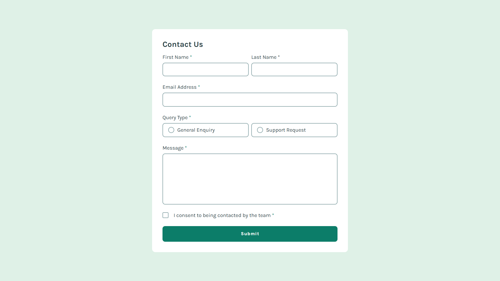

# Frontend Mentor - Contact form solution

This is a solution to the [Contact form challenge on Frontend Mentor](https://www.frontendmentor.io/challenges/contact-form--G-hYlqKJj). Frontend Mentor challenges help you improve your coding skills by building realistic projects.

## Table of contents

- [Frontend Mentor - Contact form solution](#frontend-mentor---contact-form-solution)
  - [Table of contents](#table-of-contents)
  - [Overview](#overview)
    - [The challenge](#the-challenge)
    - [Screenshot](#screenshot)
    - [Links](#links)
  - [My process](#my-process)
    - [Built with](#built-with)
    - [What I learned](#what-i-learned)
    - [Continued development](#continued-development)
    - [Useful resources](#useful-resources)
  - [Author](#author)

**Note: Delete this note and update the table of contents based on what sections you keep.**

## Overview

### The challenge

Users should be able to:

- Complete the form and see a success toast message upon successful submission
- Receive form validation messages if:
  - A required field has been missed
  - The email address is not formatted correctly
- Complete the form only using their keyboard
- Have inputs, error messages, and the success message announced on their screen reader
- View the optimal layout for the interface depending on their device's screen size
- See hover and focus states for all interactive elements on the page

### Screenshot

### Links

- Solution URL: [Solution](https://www.frontendmentor.io/solutions/contact-form-using-js-and-css-flexbox-bDK71BlRHT)
- Live Site URL: [Live Site](https://kurokurome.github.io/contact-form-frontend/)

## My process

### Built with

- Semantic HTML5 markup
- CSS custom properties
- Flexbox

### What I learned

I'm getting understand about validating form through JavaScript and learnt about using images as checkbox input or radio inputs in CSS

### Continued development

Learning about responsive website. Having a clean code to do it.

### Useful resources

- [W3Schools](https://www.w3schools.com/js/js_htmldom.asp) - This helped me for all HTML DOM to be used. Great website to learn.
- [Medium](https://kyoshee.medium.com/building-custom-checkbox-using-only-html-and-css-no-js-1-babd79d5e2e9) - This is an amazing article which helped me understand how to use image as a checkbox and also can be applied the same with radio input type. I'd recommend it to anyone still learning this concept.

## Author

- Github - [Mashironn/KuroKurome](https://github.com/kurokurome)
- Frontend Mentor - [@kurokurome](https://www.frontendmentor.io/profile/kurokurome)
